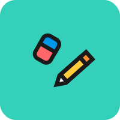

Hi, I’m Renan Mendes 👋. 

I'm a front-end dev, designer and chemist.

## My Stack
- Dart
- Flutter
- Supabase
- SQL | PostgreSQL | SQLite
- Python

--------

 
## Projects
- Minilabs - Science labs
- Kanji no Yama - Japanese Teaching with short lessons
- Rottas UFC - Find routes, buses and places at the Federal University of Ceará - Campus do Pici

---
  
 
## Design

- UI Design
- Material Design
- Figma
- Inkscape
- Adobe Suite
- Innovation and Creativity

---

 
## Learning
- Keras
- DeepXDE
- Pytorch
- Svelte

---

 
## Languages
- 🗽 English | intermediate
- 🇧🇷 Portuguese | native
- 🗾 Japanese | intermediate
- 🪆 Russian | basic

---

 
## Academia
- :test_tube: Chemistry Technician
- :gear: Chemical Engineer

---

You can find me at [linkedin](https://www.linkedin.com/in/renan-mendes-frota/)

<!---
takenoto/takenoto is a ✨ special ✨ repository because its `README.md` (this file) appears on your GitHub profile.
You can click the Preview link to take a look at your changes.
--->
